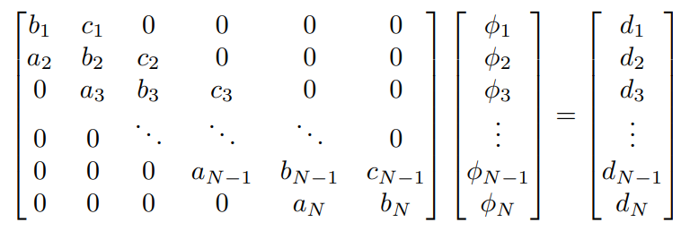

## Metodología Numérica 

Al buscar una metodología numérica para resolver la ecuación de calor, se puede observar que los métodos explícitos, aunque son más fáciles de programar, presentan limitaciones significativas  en cuanto a estabilidad y eficiencia computacional. En una dimensión, puede ser fácil aumentar el número de puntos de la malla de 100 a 1000, pero para una malla bidimensional, estos aumentos son prácticamente inviables.  Por esta razón, se optó por el método de Crank-Nicolson. A diferencia de los métodos explícitos, Crank-Nicolson es incondicionalmente estable, lo que permite utilizar pasos de tiempo mayores sin perder estabilidad numérica. Además, su esquema promedio entre el tiempo actual y el siguiente mejora significativamente la precisión temporal en comparación con otros métodos implícitos más simples. Aunque su implementación es más compleja, el rendimiento obtenido y la calidad de los resultados justifican su elección para el problema a resolver.

## Método de Crank-Nicolson

Este método consiste en una técnica numérica para resolver ecuaciones diferenciales parciales, especialmente la ecuacion de calor o ecuación de difusión. Es un metodo semi-implicito y de segundo orden; por lo que combina la precisión del método del punto medio y la estabilidad del método implicito. 
En síntesis, este método se basa en una promediación entre el método explícito, que evalúa  en el tiempo actual $t_n$ y el método implicito, que evalúa en el siguiente tiempo $t_n+1$. \
En el apartado de los codigos, se explicara a detalle los codigos realizados con el fin de comprender a totalidad cómo funciona el método de Crank-Nicolson para resolver la ecuacion de calor en 2D. 

**Ventajas:**

**1)** Estabilidad incondicional: Es estable para cualquier tamano de paso en el tiempo, lo que permite hacer simulaciones con pasos grandes sin que el error explote.\
**2)** Mayor precision: Tanto el tiempo como el espacio es de segudno orden, significa que es mas preciso que los metodos de primer orden, como lo es el metodo explicito o el implicito simple.\
**3)** Simetria temporal: Este metodo es centrado en el tiempo, lo que lo hace ideal para problemas en donde se debe de conservar energia o simetria. 

**Desventajas:**

**1)** Se requiere resolver un sistema lineal en cada paso: Con el metodo de Crank-Nicolson tenemos que resolver matrices en cada paso del tiempo, lo que es mucho mas costoso computacionalmente.\
**2)** Oscilaciones no fisicas: Si esto se aplica a problemas de condiciones inciales, puede producir oscilaciones no reales.\
**3)** Implementacion mas compleja: Este metodo requiere mas trabajo para programarlo, puesto que combina terminos del tiempo actual y del siguiente paso.

## Alternating Direction Implicit (ADI)
Es un método que se utiliza para resolver más fácilmente la ecuación de calor en 2D.
En lugar de resolver una ecuación implícita en dos dimensiones al mismo tiempo (lo que da lugar a una matriz muy grande), el método ADI divide el paso de tiempo en dos mitades:
* En la primera mitad del paso de tiempo, se utiliza el método implícito solo en la dirección $x$, y se deja $y$ explícito.
* En la segunda mitad, se hace lo mismo, pero ahora $y$ es implícito y $x$ explícito.

Esto reduce el problema de 2D a varios problemas 1D, que son mucho más fáciles de resolver. Cuando se utiliza ADI, en cada paso intermedio es necsario resolver muchos sistemas 1D implícitos (uno por cada fila o columna) con forma tridiagonal.

 ## Matriz Tridiagonal
 En el proceso de implementación del método de Crank-Nicolson y API para la resolución de la ecuación de calor; organuzando los terminos, la rucación se convierte en una ecuación matricial de la forma: **$A\vec{\phi^{n+1}}=\vec{d^n}$**, donde A es una mtriz es tridiagonal de N dimensiones, con N números de subdivisiones de la descretización espacial. 
 

 Una matriz tridiagonal es una matriz en la que solo los elementos de la diagonal principal y las dos diagonales adyacentes (la superior y la inferior) pueden tener valores distintos de cero. Este patrón de estructura permite representar de manera eficiente operadores como el Laplaciano en una dimensión espacial. En el caso del esquema de Crank-Nicolson, este tipo de matriz se forma tanto en la parte implícita como en la parte explícita del método.

 A diferencia de un sistema lineal general, cuya solución mediante métodos clásicos como la eliminación gaussiana requiere un costo computacional de orden $O(N^3)$, los sistemas tridiagonales pueden resolverse en tiempo lineal, es decir, $O(N)$, utilizando el método de Thomas. Este método es una versión especializada de la eliminación de Gauss que aprovecha la estructura tridiagonal para reducir el número de operaciones necesarias. El método transforma la matriz original en una matriz triangular superior mediante una etapa de eliminación hacia adelante, y luego obtiene la solución aplicando sustitución hacia atrás.

 Al trabajar con solo tres vectores (diagonal principal, inferior y superior), se evita almacenar la matriz completa reduciendo el consumo de memoria.
