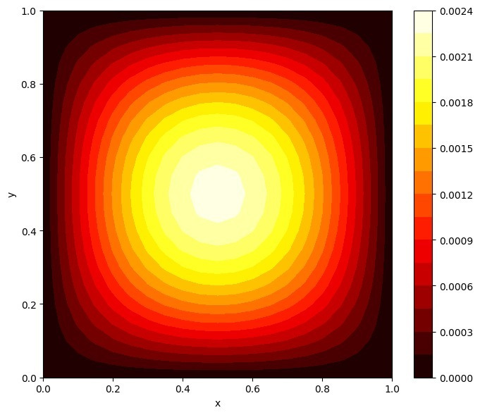
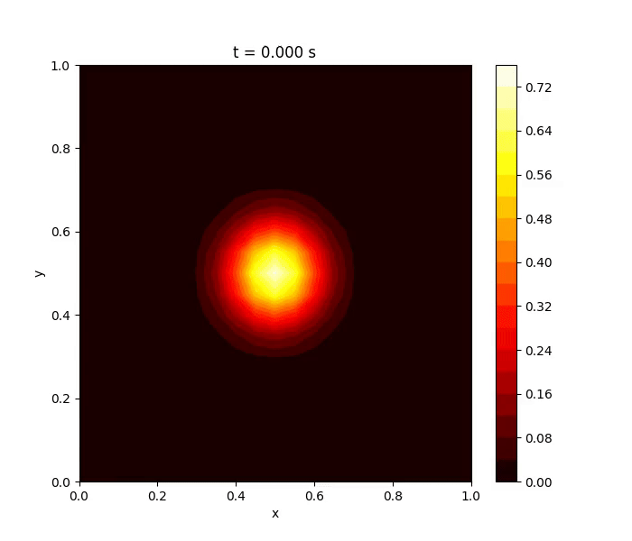
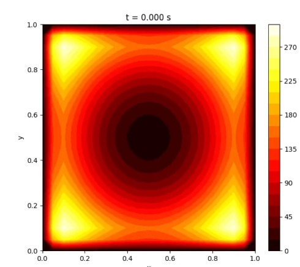
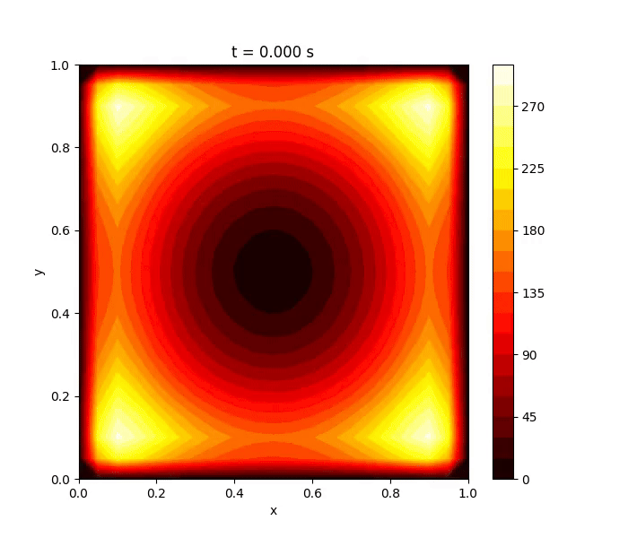
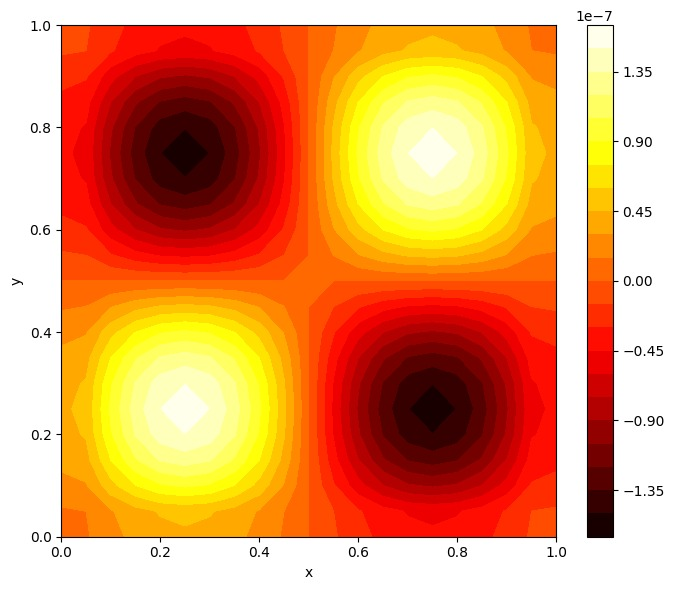
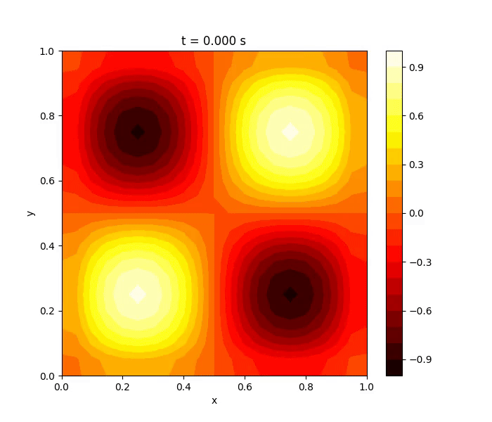

# Análisis de resultados 

## Python 

### Grafico y simulacion del pulso Gaussiano con condicion de frontera de Dirichlet.

 

 

En base a lo observado la solucion de dichos graficos es simetrica, lo cual se espera por la simetria del pulso y la geometria cuadrada. La temperaturadecrece hacia los bordes, puesto que al tener la condicion inicial de Dirichlet, la temperatura es fija en cero. Hay presencia de contornos concentricos desde el centro hacia afuera, indicando asi una difusion isotropica, es decir, una difusion igual en todas las direcciones. 
El comportamiento del grafico y la simulacion es correcto, puesto que la difusion se comporta como predice la ecuacion de calor, es decir, que se presenta una distribucion de temperatura uniforme, no hay oscilaciones artificiales ni errores numericos y se cumplen las condiciones de frontera establecidas. 

### Grafico y simulacion de un paraboloide centrado con condicion de frontera de Neumann.

 

 

Al tener dichas condiciones iniciales y de frontera, las mismas hacen que se refleje el calor, lo que provoca que no se pierda energia termica por las fronteras. Se observa una acumulacion de calor en las esquinas, lo que es caracteristico cuando se inicia con un minimo central y se impide que el calor escape. Ademas, el gradiente de temperatura apunta hacia el centro, lo cual es consistente cuando se presenta un paraboloide negativo. 
Por lo que los resultados de este grafico y simulacion son los esperados, ya que se observa que no hay perdida de calor por los bordes, que la condicion de Neumann esta bien aplicada y que respeta las simetrias y propiedades del metodo utilizado. 

### Grafico y simulacion de una onda senosoidal con condicion de frontera de Robin. 

 

 

Se logra observar que el patron senoidal se conserva, lo que sugiere una posible solucion estacionaria o un estado inicial muy cercano al equilibrio. EL grafico y la simulacion muestra dos maximos positivos y dos minimos negativos, lo que es correcto cuando se trabaja con una onda con 2 ciclos en cada eje. Los valores son muy pequeno, lo que indica que el sistema esta cerrado cerca del equilibrio termico o con condiciones suaves.
La condicion de frontera de Robin, permite un intercambio parcial de calor en los bordes, lo que es coherente con la conservacion parcial del perfil de onda, ademas, en soluciones senoidales estacionarias es comun ver un patron simetrico y balanceado positivo-negativo, lo cual, se logra apreciar en el grafico y la simulacion. 
